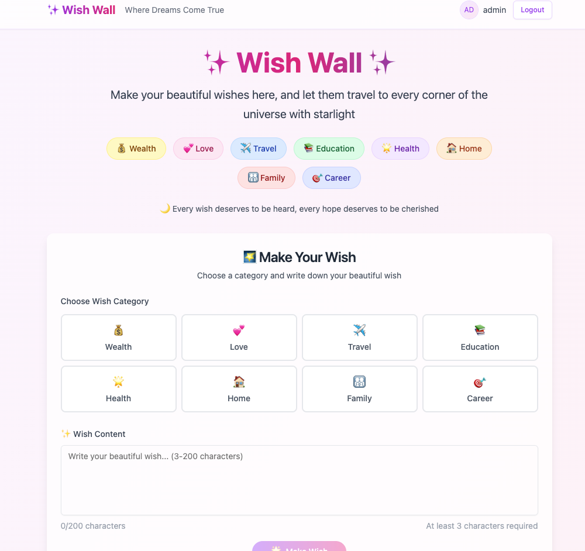

# Wish Wall

A beautiful wish wall application where dreams come true.


## 📁 Project Structure

```
wish-wall/
├── backend/                # Backend service (Flask + SQLAlchemy)
│   ├── app/               # Core application code
│   │   ├── model/         # Data models
│   │   ├── route/         # API routes
│   │   ├── service/       # Business logic
│   │   ├── schema/        # Data validation schemas
│   │   ├── common/        # Common modules
│   │   ├── util/          # Utility functions
│   │   └── data/          # Data processing
│   ├── migrations/        # Database migration files
│   ├── scripts/           # Helper scripts
│   ├── tests/             # Test files
│   ├── pyproject.toml     # Python project configuration
│   ├── poetry.lock        # Dependency lock file
│   ├── Makefile          # Build and management commands
│   └── alembic.ini       # Database migration configuration
├── frontend/              # Frontend application (Next.js + React)
│   ├── src/              # Source code
│   │   ├── components/    # React components
│   │   ├── pages/        # Page components
│   │   ├── lib/          # Library files
│   │   ├── utils/        # Utility functions
│   │   ├── contexts/     # React contexts
│   │   └── styles/       # Style files
│   ├── public/           # Static assets
│   ├── package.json      # Node.js project configuration
│   ├── Dockerfile        # Frontend Docker configuration
│   └── next.config.js    # Next.js configuration
├── docker-compose.yml    # Docker services configuration
├── Makefile              # Project-level build and management commands
├── README.md            # Project documentation
└── .gitignore           # Git ignore file configuration
```

## 🚀 Quick Start

You can run this application in two ways:

### Option 1: Docker (Recommended)

#### Prerequisites
- Docker
- Docker Compose

#### Steps
1. **Clone and navigate to the project**
   ```bash
   git clone <repository-url>
   cd wish-wall
   ```

2. **Start with Docker**
   ```bash
   # Build and start all services
   make docker-up
   ```

3. **Access the application**
   - Frontend: http://localhost:3000
   - Backend API: http://localhost:8000
   - Database: localhost:3306

4. **View logs (optional)**
   ```bash
   make docker-logs
   ```

5. **Stop services**
   ```bash
   make docker-down
   ```

### Option 2: Local Development

#### Prerequisites
- Python 3.12+
- Poetry (Python package manager)
- Node.js 18+
- npm or yarn
- MySQL 8.0

#### First-time Setup

1. **Install dependencies**
   ```bash
   make install
   ```

2. **Initialize database**
   ```bash
   make db-init
   make db-seed  # Optional: Generate test data
   ```

3. **Start services**
   ```bash
   make dev  # Starts both backend and frontend
   ```

#### Daily Development

```bash
# Start development environment (backend starts 10s first, then frontend)
make dev

# Check service status
make status

# Stop all services
make stop
```

## 🛠️ Development Commands

### Project-level Commands (Recommended for use in project root)

```bash
make help                # Show all available commands

# 🚀 Quick Start
make dev                # Start full-stack services (backend starts 10s first)
make docker-up          # Start full-stack services with Docker

# 🔧 Individual Services
make backend            # Start backend development server
make frontend           # Start frontend development server

# 🐳 Docker Management
make docker-build       # Build Docker images
make docker-up          # Start Docker containers
make docker-down        # Stop Docker containers
make docker-logs        # View Docker logs
make docker-clean       # Clean Docker resources

# 📦 Project Management
make install            # Install all dependencies
make clean              # Clean cache and temporary files
make test               # Run all tests
make lint               # Code linting
make format             # Format code
make stop               # Stop all services

# 🗄️ Database Management
make db-init            # Initialize database
make db-migrate         # Run database migrations
make db-seed            # Generate seed data

# 📊 Project Information
make status             # Check service status
make logs               # View service logs
```

### Backend Commands (in backend/ directory)

```bash
make help                # Show all available commands

# Code Quality
make format             # Format code
make lint               # Code linting
make quality            # Run all quality checks

# Testing
make test               # Run all tests
make test-unit          # Run unit tests
make test-api           # Run API tests

# Database
make migrations-generate MSG='description'  # Generate migration
make migrations-upgrade                     # Apply migrations
make migrations-downgrade                   # Rollback migrations
make seed                                  # Generate seed data

# Development
make dev                # Start development server
```

### Frontend Commands (in frontend/ directory)

```bash
npm run dev      # Start development server
npm run build    # Build production version
npm run start    # Start production server
npm run lint     # Code linting
```

## 🏗️ Tech Stack

### Backend
- **Framework**: Flask
- **Database**: SQLAlchemy ORM with MySQL
- **Migrations**: Alembic
- **Validation**: Pydantic
- **Testing**: pytest
- **Code Quality**: ruff, mypy
- **Documentation**: Flasgger (Swagger)
- **Authentication**: JWT (JSON Web Tokens)

### Frontend
- **Framework**: Next.js 15
- **UI Library**: React 18
- **Styling**: Tailwind CSS
- **Components**: Radix UI
- **Forms**: React Hook Form + Zod
- **HTTP Client**: Axios
- **Type Checking**: TypeScript
- **Authentication**: JWT with refresh tokens

## 📋 Available Endpoints

### Authentication
- `POST /api/auth/login` - User login
- `POST /api/auth/register` - User registration
- `POST /api/auth/logout` - User logout

### Wishes
- `GET /api/wishes` - Get all wishes
- `POST /api/wishes` - Create new wish
- `GET /api/wishes/{id}` - Get specific wish
- `PUT /api/wishes/{id}` - Update wish
- `DELETE /api/wishes/{id}` - Delete wish

### Comments
- `GET /api/wishes/{id}/comments` - Get wish comments
- `POST /api/wishes/{id}/comments` - Add comment to wish

## 🧪 Testing & Verification

### Test Docker Setup
```bash
# Start services
make docker-up

# Verify all containers are running
docker-compose ps

# Test frontend
curl http://localhost:3000

# Test backend API
curl http://localhost:8000/api/health

# Stop services
make docker-down
```

### Test Local Development
```bash
# Install dependencies
make install

# Start services
make dev

# In another terminal, check status
make status

# Stop services
make stop
```

### Run Tests
```bash
# Run all tests
make test

# Run linting
make lint

# Format code
make format
```

## 🔧 Environment Variables

### Backend
- `DB_HOST` - Database host (default: localhost)
- `DB_PORT` - Database port (default: 3306)
- `DB_USERNAME` - Database username
- `DB_PASSWORD` - Database password
- `DB_NAME` - Database name
- `SECRET_KEY` - Flask secret key
- `JWT_SECRET_KEY` - JWT signing key

### Frontend
- `NEXT_PUBLIC_API_URL` - Backend API URL (default: http://localhost:8000/api)
- `NODE_ENV` - Environment (development/production)

## 📝 Development Notes

### Database Schema
The application uses the following main entities:
- **Users**: User accounts with JWT authentication
- **Wishes**: User wishes with categories (Wealth, Love, Travel, Health, Career, Study, Family)
- **Comments**: Comments on wishes with blessing functionality

### Authentication Flow
1. User registers/logs in with credentials
2. Backend returns JWT access token and optional refresh token
3. Frontend stores tokens and includes Authorization header in requests
4. Backend validates JWT on protected routes

### Docker Services
- **mysql**: MySQL 8.0 database with persistent volume
- **backend**: Flask application with automatic migrations and seed data
- **frontend**: Next.js development server with hot reload

## 🤝 Contributing

1. Fork the repository
2. Create a feature branch
3. Make your changes
4. Run tests: `make test`
5. Run linting: `make lint`
6. Submit a pull request

## 📄 License

This project is licensed under the MIT License. 